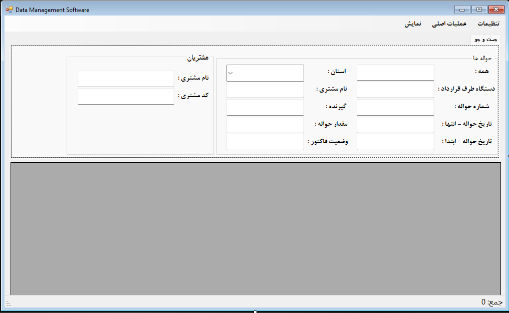
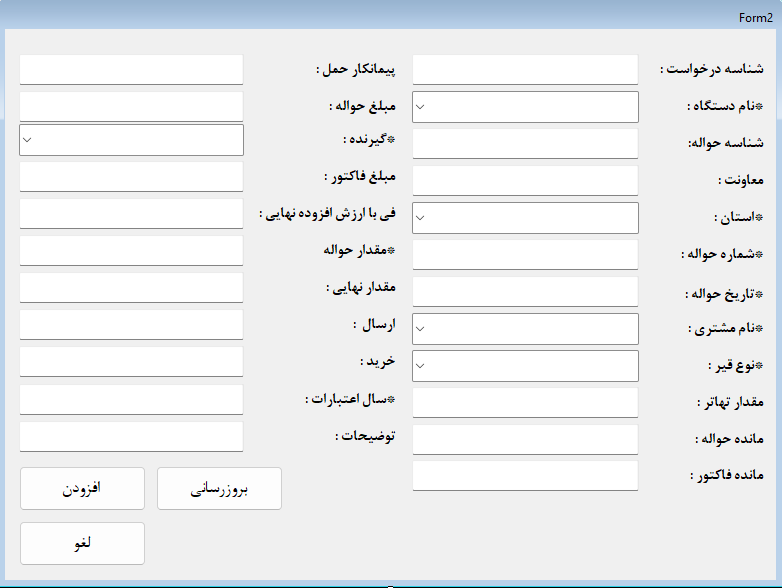
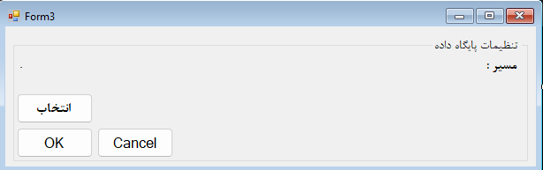
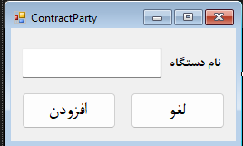
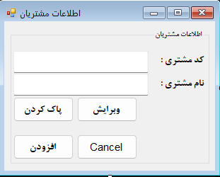

# Data Management Software

A Windows desktop application built with **C# WinForms** for managing delivery records, customers, contract organizations, and bitumen-related sales/dispatch data using a local **Microsoft Access** database.

The application is designed for small business/internal office use where users need to manage customer records, government/contract-party organizations, delivery notes, invoice information, and remaining balances in one simple Windows interface.

---

## 📸 Screenshots

Add your screenshots to a folder named `screenshots/` in the root of the repository, then update the image paths if needed.

### Main Window



### Add / Edit Delivery Record Form



### Database Settings Form



### Contract Party Form



### Customer Information Form



---

## 📌 Main Features

### Delivery / Havale Management

The main part of the application is used to manage delivery records stored in `Table1`.

Supported fields include:

- Contract organization / government agency
- Province
- Credit year
- Request ID
- Delivery ID
- Delivery number
- Delivery date
- Customer name
- Bitumen type
- Receiver
- Delivery amount
- Invoice amount
- VAT-included unit price
- Sent amount
- Purchased amount
- Final amount
- Remaining delivery balance
- Remaining invoice balance
- Description

Users can:

- Add new delivery records
- Edit existing records
- Double-click a row in the main table to open the record in edit mode
- Update records directly in the database
- Delete selected records from `Table1` using the keyboard `Delete` key with confirmation

---

### Customer Management

The application includes a customer management form for storing customer information in `Table2`.

Supported customer fields:

- Customer code
- Customer name

Users can add, edit, delete, and reuse customer names inside the delivery record form.

---

### Contract Organization Management

The application includes a form for managing contract organizations or government agencies stored in `Table3`.

Supported field:

- Organization / agency name

These organization names can be loaded into ComboBoxes inside the record form.

---

### Bitumen Type Selection

The application can load bitumen names from `Table4`.

Supported field:

- Bitumen name

These values are used in the record form for selecting the bitumen type.

---

### Search and Filtering

The main form includes search/filter input fields for finding records based on fields such as:

- Province
- Contract organization
- Delivery number
- Delivery date range
- Customer name
- Receiver
- Delivery amount
- Invoice status

---

### Selected Cell Sum

The main window includes a bottom status label that calculates the sum of selected numeric cells in the `DataGridView`.

This is useful for quickly checking totals without exporting the data.

---

### CSV Export

The application supports exporting visible `DataGridView` data to a `.csv` file.

The CSV export uses **UTF-8 with BOM**, which helps Persian text display correctly in tools like Microsoft Excel.

---

## 🧩 Forms

### `MainForm`

The main application window.

Responsibilities:

- Load database tables into `DataGridView`
- Display delivery, customer, and contract-party data
- Search/filter records
- Calculate selected numeric cell totals
- Export data to CSV
- Open add/edit forms
- Handle double-click editing for `Table1`
- Handle delete key record deletion for `Table1`

---

### `RecordInfoForm` / `Form2`

The delivery record form.

Used for both:

- Adding new records
- Editing existing records

Behavior:

- In add mode, the **Add** button is active and the **Update** button is disabled.
- In edit mode, the **Update** button is active and the **Add** button is disabled.
- When opened from a double-click on a `Table1` row, the selected record fields are loaded into the form.

---

### `ClienInfoForm`

The customer information form.

Used for adding, editing, and deleting customers.

---

### `ContractParty`

The contract organization form.

Used for adding government agencies / contract organizations.

---

### `DBInfoForm`

The database settings form.

Used for selecting the Microsoft Access database file and saving the last selected path in application settings.

---

## 🗃️ Database Structure

The application uses a local Microsoft Access database file:

```text
.accdb / .mdb
```

### `Table1` — Delivery / Havale Records

| Field | Description |
|---|---|
| ردیف | AutoNumber primary key |
| دستگاه طرف قرارداد | Contract organization / government agency |
| استان | Province |
| سال اعتبارات | Credit year |
| شناسه حواله | Delivery ID |
| شناسه درخواست | Request ID |
| معاونت | Department / deputy |
| شماره حواله | Delivery number |
| تاریخ حواله | Delivery date |
| نام مشتری | Customer name |
| نوع قیر | Bitumen type |
| گیرنده | Receiver |
| مبلغ حواله | Delivery value |
| مقدار حواله | Delivery amount |
| فی (با ارزش افزوده) | VAT-included unit price |
| ارسال | Sent amount |
| خرید | Purchased amount |
| مقدار نهایی | Final amount |
| پیمانکار حمل | Transport contractor |
| مبلغ فاکتور | Invoice amount |
| مانده حواله | Remaining delivery balance |
| مانده فاکتور | Remaining invoice balance |
| توضیحات | Description |

---

### `Table2` — Customers

| Field | Description |
|---|---|
| ردیف | AutoNumber primary key |
| کد مشتری | Customer code |
| نام مشتری | Customer name |

---

### `Table3` — Contract Organizations

| Field | Description |
|---|---|
| ردیف | AutoNumber primary key |
| نام دستگاه | Government agency / contract organization name |

---

### `Table4` — Bitumen Types

| Field | Description |
|---|---|
| ردیف | AutoNumber primary key |
| نام قیر | Bitumen name |

---

## 🧮 Automatic Calculations

The application calculates the remaining delivery balance using this formula:

```text
مانده حواله = مقدار نهایی - (ارسال + خرید + مقدار تهاتر)
```

---

## 🖥️ Technologies Used

- C#
- Windows Forms / WinForms
- .NET Framework
- Microsoft Access Database
- OleDb
- DataGridView
- CSV export
- Visual Studio

---

## ⚙️ Requirements

To run the application, the target system needs:

- Windows OS
- .NET Framework compatible with the project
- Microsoft Access Database Engine / OLEDB Provider

For `.accdb` files, the application uses:

```text
Microsoft.ACE.OLEDB.16.0
```

If the application cannot connect to the database, install:

```text
Microsoft Access Database Engine 2016 Redistributable
```

Important:

```text
The application platform target and the Access Database Engine architecture must match.

x64 application  →  64-bit Access Database Engine
x86 application  →  32-bit Access Database Engine
```

---

## 🚀 How to Run

1. Clone the repository.
2. Run the application.
3. Select the Access database file from the database settings form.
4. Load the required table from the menu.
5. Add, edit, search, delete, or export records.

---

## 🧪 Typical Workflow

1. Open the application.
2. Select the database file.
3. Add customers from the customer form.
4. Add contract organizations from the contract-party form.
5. Add bitumen types to the database.
6. Open the delivery record form and create a new record.
7. Load `Table1` in the main grid.
8. Double-click a record ID to edit it.
9. Select full rows and press `Delete` to remove records after confirmation.
10. Select numeric cells to calculate their sum at the bottom of the main window.

---

## 📤 Exporting Data

The application can export the current `DataGridView` content to CSV.

Exported files can be opened with:

- Microsoft Excel
- Google Sheets
- LibreOffice Calc
- Any text editor

---

## 📁 Suggested Repository Structure

```text
DataManagementSoftware/
│
├── README.md
├── afshin.sln
├── afshin/
│   ├── MainForm.cs
│   ├── RecordInfoForm.cs
│   ├── ClienInfoForm.cs
│   ├── ContractParty.cs
│   ├── DBInfoForm.cs
│   ├── Class1.cs
│   └── Program.cs
│
└── screenshots/
    ├── main-window.png
    ├── record-form.png
    ├── database-settings.png
    ├── contract-party-form.png
    └── customer-info-form.png
```

---

## 🔮 Future Improvements

- User login system
- User roles and permissions
- Advanced reporting
- PDF invoice generation
- Automatic database backup
- Better UI/UX design
- SQL Server support
- Search result highlighting
- More advanced financial reports
- Safer delete logs / soft delete system

---

## 👨‍💻 Developer

Developed as a C# WinForms desktop application for managing customer, delivery, contract-party, and bitumen sales/dispatch records.

---

## 📄 License

This project is currently intended for personal, educational, or internal business use.
